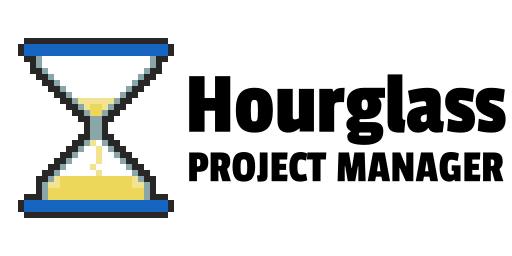

A project manager for Godot Engine

Hourglass is the project manager you've been waiting for. It keeps
track of all your Godot projects as well as the Godot Engine versions they
require. It aims to match and exceed all the features of the built-in project
manager (though it's not there yet).

## Download
- [Download for Linux](https://jwestman.gitlab.io/hourglass/hourglass-linux.tar.gz)
- [Download for macOS](https://jwestman.gitlab.io/hourglass/hourglass-macos.zip)
- [Download for Windows](https://jwestman.gitlab.io/hourglass/hourglass-windows.zip)

## Build Instructions
Hourglass itself is a Godot Engine project, written in pure GDScript. However, it
uses a slightly modified engine, in order to read ZIP files using scripts. The
modifications [have been submitted upstream](https://github.com/godotengine/godot/pull/34444).
Until they are reviewed and accepted, you will need to use
[this branch](https://github.com/flyingpimonster/godot/tree/zip-module-3.2) instead.
You can [download prebuilt binaries](https://gitlab.com/jwestman/hourglass-zip-module)
or build it from scratch by following
[the instructions in Godot's documentation](https://docs.godotengine.org/en/latest/development/compiling/index.html).

## Contributing
Contributions are welcome! If you found a bug or have an idea for a new
feature, please file an issue on GitLab. If you'd like to contribute a bugfix,
please file a merge request.

If you contribute code, we'd appreciate if you try to stick to the [official
style guide for GDScript](https://docs.godotengine.org/en/3.2/getting_started/scripting/gdscript/gdscript_styleguide.html).
This helps keep the code organized and easily readable for all contributors.

Hourglass follows the [Godot Code of Conduct](https://godotengine.org/code-of-conduct).

## License
Hourglass is licensed under the GNU General Public License, version
3 or, at your option, any later version.

The logo images in `data/template` are licensed under CC-BY-3.0. The icon
at `data/icon_star.svg` is from the Godot Engine source code, under the MIT
license. Noto Sans, in `data/font`, is licensed under the Apache License,
version 2.0 (see `data/font/LICENSE.txt`).

The Hourglass logo (`data/icon.png`) was created by u/BlueCannonBall on reddit.

---

Copyright (C) 2019 James Westman

This program is free software: you can redistribute it and/or modify
it under the terms of the GNU General Public License as published by
the Free Software Foundation, either version 3 of the License, or
(at your option) any later version.

This program is distributed in the hope that it will be useful,
but WITHOUT ANY WARRANTY; without even the implied warranty of
MERCHANTABILITY or FITNESS FOR A PARTICULAR PURPOSE.  See the
GNU General Public License for more details.

You should have received a copy of the GNU General Public License
along with this program.  If not, see <https://www.gnu.org/licenses/>.
